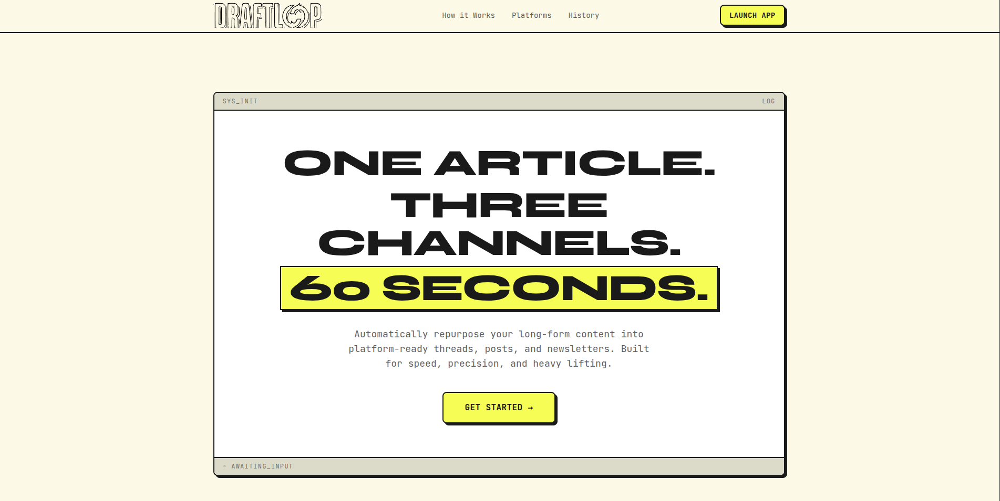
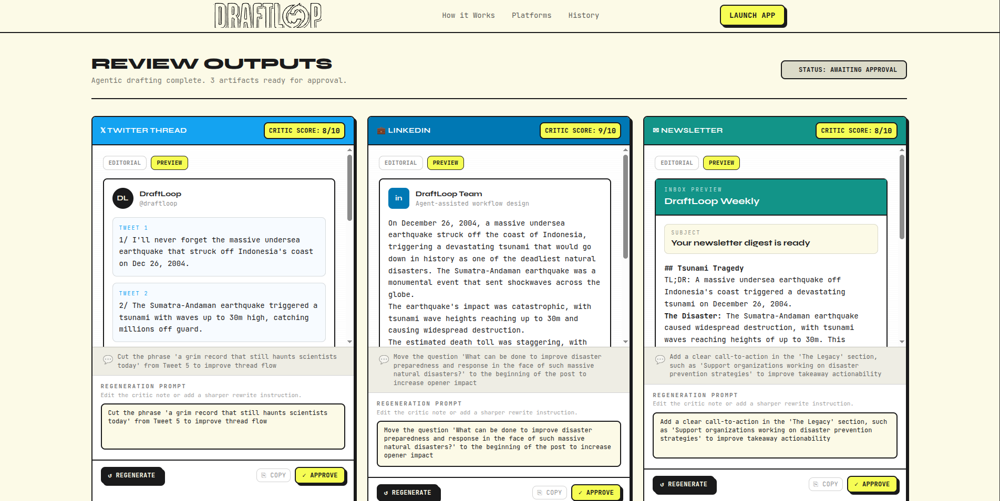
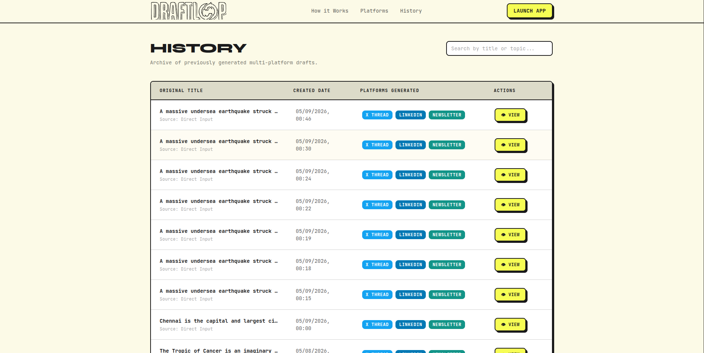
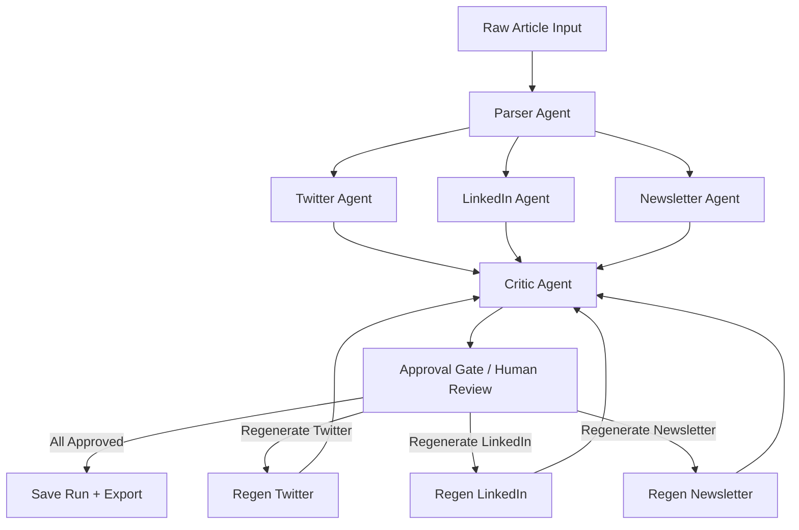
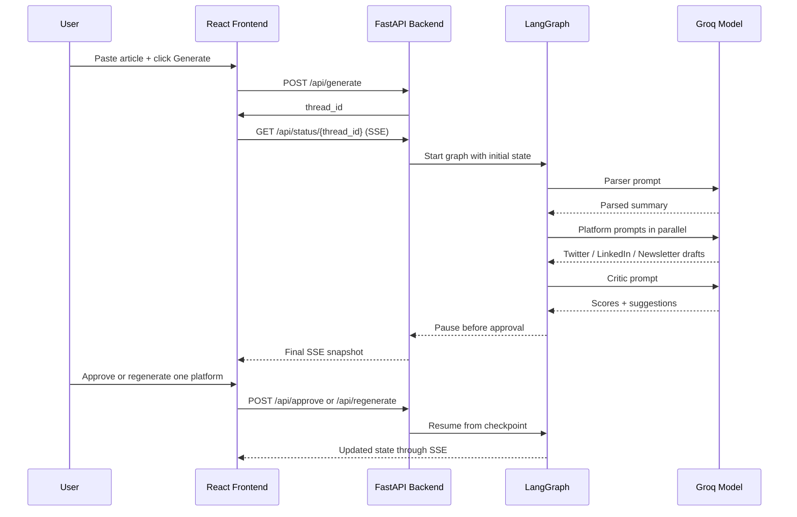

# DraftLoop

**One article. Three channels. 60 seconds.**

DraftLoop is a multi-agent content repurposing app that turns one long-form article into:

- a Twitter / X thread
- a LinkedIn post
- a newsletter digest

Instead of using one single LLM call, DraftLoop uses a structured LangGraph workflow with specialist agents, real-time status streaming, human approval, selective regeneration, and local run history.

## Screenshots





## What Problem It Solves

Repurposing a good article into multiple channels is repetitive and slow. A creator might write one strong long-form piece, then spend another 1-2 hours manually rewriting it for:

- Twitter / X
- LinkedIn
- newsletter readers

DraftLoop compresses that workflow into a guided agentic pipeline:

1. Paste one article.
2. Let specialist agents generate channel-specific drafts in parallel.
3. Review them side by side.
4. Approve the good ones.
5. Regenerate only the ones you want improved.
6. Export the final approved set in multiple formats.

## Core Features

- Parallel multi-agent generation with LangGraph
- Live agent status updates via Server-Sent Events
- Critic scoring and feedback for each platform draft
- Human-in-the-loop approval flow
- Selective regeneration with editable rewrite instructions
- Live diff view for regenerated drafts
- Platform preview mode for each output
- Local history stored in IndexedDB
- One-click export pack:
  - Markdown pack
  - Notion-ready export
  - copy bundle
  - social posting kit
- Read-only history replay for saved runs
- Responsive landing, review, and history views

## Tech Stack

### Frontend

- React 18
- TypeScript
- Vite
- Tailwind CSS
- Zustand for UI/session state
- `react-markdown` for rich draft rendering
- IndexedDB via `idb` for local history persistence

### Backend

- Python 3.12+
- FastAPI
- LangGraph
- LangChain Core
- LangChain Groq
- SSE Starlette for real-time event streaming
- Pydantic / Pydantic Settings

### Model / AI Layer

- Groq API
- Default model: `llama-3.3-70b-versatile`

## How The Project Works

DraftLoop is split into two main parts:

- a FastAPI backend that runs the LangGraph workflow
- a React frontend that streams progress, renders drafts, and manages review/export UX

### User Flow

1. The user opens the app and pastes an article.
2. The frontend sends the article to `POST /api/generate`.
3. The backend creates a new `thread_id` and stores an initial graph state.
4. The frontend opens an SSE connection to `/api/status/{thread_id}`.
5. LangGraph starts executing and streams agent progress back to the UI.
6. The parser agent extracts:
   - main topic
   - tone
   - top 5 key points
7. Three platform agents run in parallel:
   - Twitter / X
   - LinkedIn
   - Newsletter
8. A critic agent reviews all three drafts and scores each one.
9. The graph pauses before approval using `interrupt_before`.
10. The user approves drafts or regenerates specific ones with custom instructions.
11. Only the selected draft agents rerun.
12. Once all three are approved, the run is saved to local history and can be exported.

## Agent Workflow

### Agent Roles

- `Parser Agent`
  - reads the raw article
  - extracts topic, tone, and key points
- `Twitter Agent`
  - writes a thread optimized for short punchy sequencing
- `LinkedIn Agent`
  - writes a more professional, conversational post
- `Newsletter Agent`
  - writes a digest-style summary
- `Critic Agent`
  - scores drafts and suggests one actionable improvement per platform
- `Human`
  - approves or requests selective regeneration

## Mermaid Diagram

### Agent Graph



### Frontend + Backend Runtime Flow



## LangGraph Concepts Used

| Concept                                   | Where it appears                                     |
| ----------------------------------------- | ---------------------------------------------------- |
| `StateGraph`                              | `backend/app/graph/graph.py`                         |
| Typed shared state                        | `backend/app/graph/state.py`                         |
| Parallel fan-out with `Send`              | `backend/app/graph/routing.py`                       |
| Fan-in to critic                          | `backend/app/graph/graph.py`                         |
| Human interrupt with `interrupt_before`   | `backend/app/graph/graph.py`                         |
| Conditional regeneration routing          | `backend/app/graph/routing.py`                       |
| Checkpoint persistence with `MemorySaver` | `backend/app/graph/graph.py`                         |
| Resume after approval/regeneration        | `backend/app/api/routes/approve.py`, `regenerate.py` |

## Project Structure

```text
DraftLoop/
├── backend/
│   ├── app/
│   │   ├── api/
│   │   │   ├── routes/
│   │   │   │   ├── approve.py
│   │   │   │   ├── generate.py
│   │   │   │   ├── regenerate.py
│   │   │   │   ├── runs.py
│   │   │   │   └── status.py
│   │   │   └── schemas.py
│   │   ├── graph/
│   │   │   ├── nodes/
│   │   │   │   ├── approval.py
│   │   │   │   ├── critic.py
│   │   │   │   ├── linkedin.py
│   │   │   │   ├── newsletter.py
│   │   │   │   ├── parser.py
│   │   │   │   └── twitter.py
│   │   │   ├── prompts/
│   │   │   │   ├── critic.py
│   │   │   │   ├── linkedin.py
│   │   │   │   ├── newsletter.py
│   │   │   │   ├── parser.py
│   │   │   │   └── twitter.py
│   │   │   ├── graph.py
│   │   │   ├── routing.py
│   │   │   └── state.py
│   │   ├── config.py
│   │   ├── dependencies.py
│   │   └── main.py
│   ├── pyproject.toml
│   └── uv.lock
├── frontend/
│   ├── public/
│   ├── src/
│   │   ├── components/
│   │   │   ├── draft/
│   │   │   ├── history/
│   │   │   ├── landing/
│   │   │   ├── review/
│   │   │   └── ui/
│   │   ├── hooks/
│   │   ├── lib/
│   │   ├── pages/
│   │   ├── store/
│   │   ├── App.tsx
│   │   ├── index.css
│   │   └── main.tsx
│   ├── package.json
│   └── vite.config.ts
├── CLAUDE.md
└── README.md
```

## Important Files

### Backend

- `backend/app/main.py`
  - FastAPI app entrypoint
  - CORS setup
  - route registration

- `backend/app/config.py`
  - environment-based settings
  - Groq API key
  - model name
  - artificial agent delay for visible UI streaming

- `backend/app/dependencies.py`
  - module-level singleton LangGraph instance
  - in-memory pending thread states

- `backend/app/graph/state.py`
  - typed LangGraph shared state

- `backend/app/graph/graph.py`
  - full graph definition
  - agent nodes
  - parallel edges
  - approval interrupt

- `backend/app/graph/routing.py`
  - fan-out logic
  - regeneration router

- `backend/app/api/routes/status.py`
  - SSE status streaming
  - graph event to frontend agent-state mapping

### Frontend

- `frontend/src/pages/DraftApp.tsx`
  - input page
  - article textarea
  - generation start

- `frontend/src/pages/Review.tsx`
  - review flow
  - approval
  - regeneration
  - toasts
  - export pack

- `frontend/src/components/review/DraftCard.tsx`
  - draft rendering
  - markdown view
  - preview mode
  - live diff mode

- `frontend/src/components/review/ExportPack.tsx`
  - one-click export actions

- `frontend/src/pages/History.tsx`
  - local run archive

- `frontend/src/hooks/useSSE.ts`
  - SSE connection lifecycle
  - graph progress updates

- `frontend/src/lib/db.ts`
  - IndexedDB history persistence

- `frontend/src/lib/exportPack.ts`
  - file export generation logic

## API Endpoints

| Method | Route                     | Purpose                             |
| ------ | ------------------------- | ----------------------------------- |
| `POST` | `/api/generate`           | Start a new run                     |
| `GET`  | `/api/status/{thread_id}` | Stream graph progress via SSE       |
| `POST` | `/api/approve`            | Approve one or more drafts          |
| `POST` | `/api/regenerate`         | Regenerate selected drafts          |
| `GET`  | `/api/runs/{thread_id}`   | Fetch a graph snapshot by thread id |
| `GET`  | `/health`                 | Health check                        |

## Environment Variables

### Backend `.env`

Create `backend/.env` with:

```env
GROQ_API_KEY=your_groq_api_key
MODEL_NAME=llama-3.3-70b-versatile
AGENT_DELAY_SECONDS=2.0
```

Notes:

- `GROQ_API_KEY` is required
- `MODEL_NAME` is optional because the backend already defaults to `llama-3.3-70b-versatile`
- `AGENT_DELAY_SECONDS` is optional and mainly used so the frontend status animation is visible during demos

### Frontend `.env`

Create `frontend/.env` with:

```env
VITE_API_URL=http://localhost:8000
```

## Setup

### Prerequisites

- Python `3.12+`
- Node.js `18+`
- `uv`
- a Groq API key

### 1. Clone the repo

```bash
git clone <your-repo-url>
cd DraftLoop
```

### 2. Start the backend

```bash
cd backend
uv sync
uv run uvicorn app.main:app --reload --port 8000
```

Backend will run at:

```text
http://localhost:8000
```

Health check:

```text
http://localhost:8000/health
```

### 3. Start the frontend

Open another terminal:

```bash
cd frontend
npm install
npm run dev
```

Frontend will run at:

```text
http://localhost:5173
```

## How To Use

1. Open `http://localhost:5173`
2. Click `Launch App`
3. Paste a long-form article into the input area
4. Click `Generate Drafts`
5. Watch the parser, platform agents, and critic update live
6. Review all 3 outputs on the review page
7. Use:
   - `Editorial` view
   - `Preview` view
   - `Live Diff` after regeneration
8. Edit the `Regeneration Prompt` for any platform you want rewritten
9. Approve drafts one by one
10. Once all are approved:

- save to local history
- export as Markdown / Notion / copy bundle / social kit

## Export Options

After all drafts are approved, DraftLoop offers:

- `Markdown Pack`
  - full multi-platform bundle with summary and critic notes
- `Notion-Ready`
  - cleaner markdown structure for Notion import
- `Copy Bundle`
  - copy-friendly combined text block
- `Social Posting Kit`
  - posting sequence + critic reminder bundle

## Local History

History is stored locally in the browser using IndexedDB.

That means:

- no remote database is required
- saved runs persist in the browser you used
- opening a history item shows a read-only review snapshot

## Responsive Design Notes

The app has been tuned for:

- mobile
- tablet
- desktop

This includes:

- stacked review actions on smaller screens
- mobile-safe history layout
- responsive landing page typography
- horizontally scrollable workflow animation on small devices

## Development Commands

### Frontend

```bash
cd frontend
npm run dev
npm run build
npm run lint
```

### Backend

```bash
cd backend
uv sync
uv run uvicorn app.main:app --reload --port 8000
python -m compileall app
```

## Project Highlights

DraftLoop is more than a wrapper around one LLM call. Key capabilities include:

- agent specialization
- parallel graph execution
- stateful graph orchestration
- human-in-the-loop approval
- selective reruns
- real-time frontend streaming
- local persistence without backend storage
- product-level UX polish on top of agentic infrastructure

## Future Improvements

Planned and potential next steps:

- ZIP export with multiple files
- authentication + cloud sync
- richer analytics on draft quality
- more platform agents
- prompt/version tracking for experiments
- persistent backend storage instead of in-memory checkpoints

## Author

Built by **Rishivel S**.
